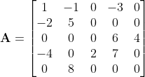
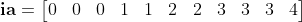
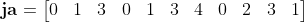
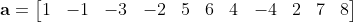
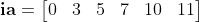
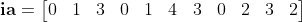
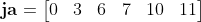
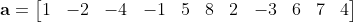

## Description
This project presents the implementation of basic sparse matrix manipulation routines.

In scientific computing, sparse matrices arise from the discretization of partial differential equations in numerical methods such as the Finite Element Method and the Finite Volume Method.
In such matrices, most entries are zero. As a result, special data structures are necessary to store the nonzero elements.
This project elaborates on three essential sparse matrix representations: the coordinate (COO) format, the Compressed Sparse Row (CSR) format, and the Compressed Sparse Column (CSC) format.
In addition, this project includes various functions to convert one format into another. 

In C, a sparse matrix can be represented by means of a structure with the following members:
   nr:      number of rows
   nnz:  number of nonzero entries in the matrix
   **ia**:     array or row indices in the COO and CSC formats, or the row pointer index in the CSR format.
   **ja**:     array of column indices in the COO and CSR formats, or the column pointer index in the CSC format.
   **a**:   array containing the nonzero entries in the sparse matrix.

**Note**:
In this project, the sparse matrices are assumed to be square, i.e., the number of rows is equal to the number of columns.


## Table of Contents

- [Example](#example)
- [Prerequisites](#prerequisites)
- [Usage](#usage)
- [License](#license)
- [Copyright Notice](#copyright-notice)
- [Disclaimer of Liability](#disclaimer-of-liability)


## Example
To illustrate the difference between these formats, consider the following **A** matrix: 



It can be seen that, for **A**, _nr = 5_ and _nnz = 11_.

Using a zero-based indexing, the input matrices are as follows:
  
### COO format








### CSR format




The row pointer array **ia** is of length (nr + 1). It indicates the index of the first nonzero entry in a row in **ja**.
Its entries are such that: ia[i+1] - ia[i] = number of nonzero entries per row. 

### CSC format









The column pointer array ja is of length (nr + 1). It indicates the index of the first nonzero entry in a column in **ia**.
Its entries are such that: ja[i+1] - ja[i] = number of nonzero entries per column.
 


## Prerequisites

- Linux environment
- gnu-gcc
- CMake
- Text editor (Vim, Gedit, Sublime Text, etc.)


## Usage
In order to run the program, follow these steps:
### Clone the repository
```bash
git clone https://github.com/0x524D/Sparse_Matrix_Operations.git
```
### Navigate to the project directory
```bash
cd Sparse_Matrix_Operations
```

### Create and navigate to the build directory
```bash
mkdir build && cd build
```

### Run CMake to configure the build
```bash
cmake ..
```

### Build the project
```bash
make 
```
### Run the executable
```bash
./bin/main
```

## Copyright Notice
Copyright (C) 2024, Rico Morasata.

This program is free software: you can redistribute it and/or modify
it under the terms of the GNU General Public License as published by
the Free Software Foundation, either version 3 of the License, or
(at your option) any later version.

This program is distributed in the hope that it will be useful,
but WITHOUT ANY WARRANTY; without even the implied warranty of
MERCHANTABILITY or FITNESS FOR A PARTICULAR PURPOSE.  See the
GNU General Public License for more details.

You should have received a copy of the GNU General Public License
along with this program.  If not, see <https://www.gnu.org/licenses/>.


## Disclaimer of Liability

THIS SOFTWARE IS PROVIDED BY RICO MORASATA "AS IS" AND ANY
EXPRESS OR IMPLIED WARRANTIES, INCLUDING, BUT NOT LIMITED TO, THE IMPLIED
WARRANTIES OF MERCHANTABILITY AND FITNESS FOR A PARTICULAR PURPOSE ARE
DISCLAIMED. IN NO EVENT SHALL RICO MORASATA BE LIABLE FOR ANY
DIRECT, INDIRECT, INCIDENTAL, SPECIAL, EXEMPLARY, OR CONSEQUENTIAL DAMAGES
(INCLUDING, BUT NOT LIMITED TO, PROCUREMENT OF SUBSTITUTE GOODS OR SERVICES;
LOSS OF USE, DATA, OR PROFITS; OR BUSINESS INTERRUPTION) HOWEVER CAUSED AND
ON ANY THEORY OF LIABILITY, WHETHER IN CONTRACT, STRICT LIABILITY, OR TORT
(INCLUDING NEGLIGENCE OR OTHERWISE) ARISING IN ANY WAY OUT OF THE USE OF THIS
SOFTWARE, EVEN IF ADVISED OF THE POSSIBILITY OF SUCH DAMAGE.


